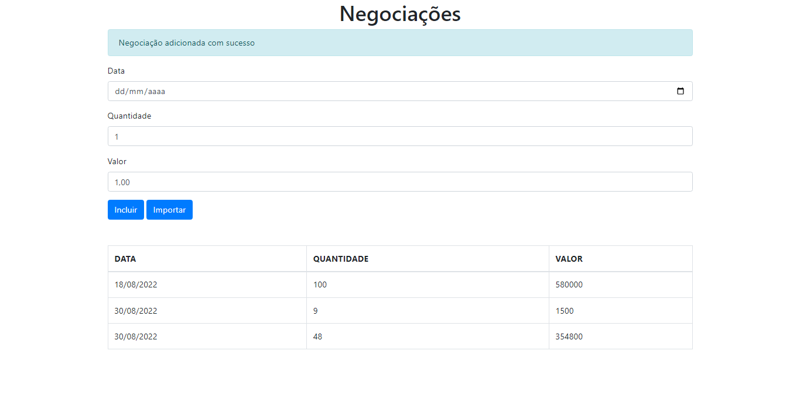

# Formação TypeScript

Aqui foram trabalhados conceitos básicos e avançados do TypeScript tais como:
Tipagem de daods, persistência, enums, decorators, services e interfaces.

Tudo isso foi aplicado no contexto de um sistema de gerenciamento de negociações bancárias.

